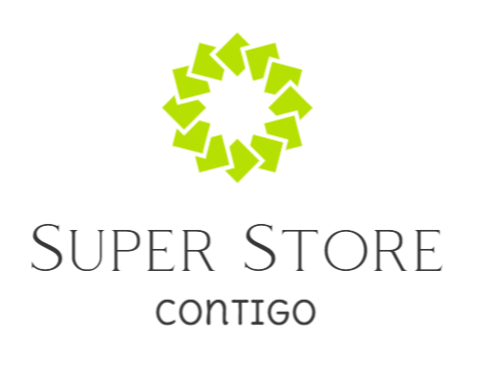
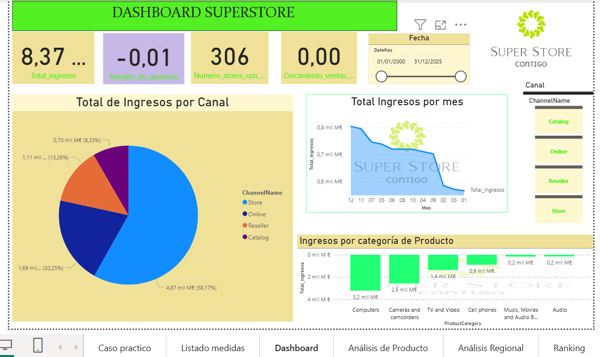
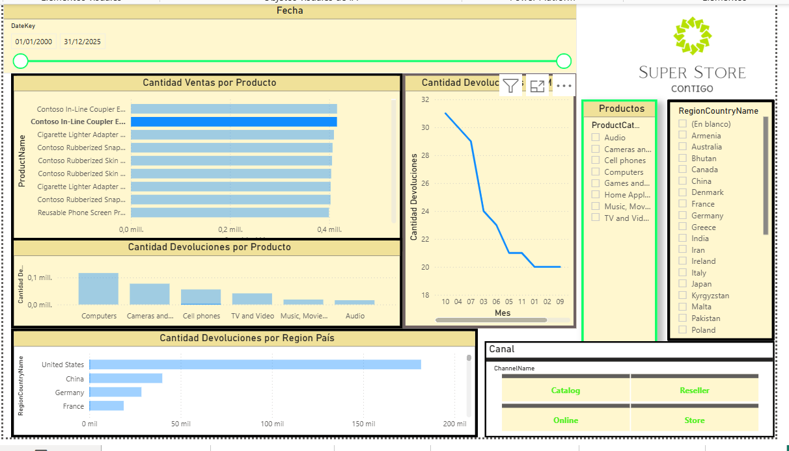

# 📊 Power BI – SuperStore Sales & Returns Dashboard

## 🚀 Introduction / Introducción

This repository contains a Power BI project built on the classic SuperStore / Contoso scenario, focused on analysing sales, profitability and returns by product, region, customer segment and channel.

Este repositorio contiene un proyecto de Power BI basado en el escenario clásico de SuperStore / Contoso, centrado en analizar ventas, rentabilidad y devoluciones por producto, región, segmento de cliente y canal.

> 🔐 The full `.pbix` file is available **on request** due to its size.  
> 🔐 El archivo `.pbix` completo se comparte **bajo petición** debido a su tamaño (y a la naturaleza de los datos)
> Este proyecto es el caso práctico final de una asignatura de máster en ENAE - Escuela de Negocios.
---

## 🎯 Business goal / Objetivo de negocio

- Understand **total revenue, margin and number of stores** over time.  
- Identify **best-performing regions, provinces and stores**.  
- Analyse **customer segments and product categories** to detect opportunities.  
- Monitor **returns volume** by product and region to support operational decisions.

- Entender la **evolución de ingresos, margen y número de tiendas** en el tiempo.  
- Identificar las **regiones, provincias y tiendas con mejor rendimiento**.  
- Analizar **segmentos de cliente y categorías de producto** para detectar oportunidades.  
- Monitorizar la **cantidad de devoluciones** por producto y región para apoyar decisiones operativas.

---

## 🧹 Data & modelling / Datos y modelado

- Source data from a SuperStore‑style retail dataset (ventas, devoluciones, tiendas, productos, canales, regiones).  
- Cleaning and transformation in **Power Query**:  
  - Standardisation of date fields and creation of a proper Date table.  
  - Normalisation of product, channel and region names.  
  - Calculation of measures needed for KPIs (revenue, margin, growth, returns).  
- Data model organised around a **fact table** and multiple **dimension tables** (Date, Product, Store, Channel, Region, Customer Segment).

- Datos de origen basados en un dataset de retail tipo SuperStore (ventas, devoluciones, tiendas, productos, canales, regiones).  
- Limpieza y transformación en **Power Query**:  
  - Estandarización de fechas y creación de una tabla de calendario.  
  - Normalización de nombres de productos, canales y regiones.  
  - Cálculo de medidas necesarias para los KPIs (ingresos, margen, crecimiento, devoluciones).  
- Modelo de datos organizado alrededor de una **tabla de hechos** y varias **tablas de dimensiones** (Fecha, Producto, Tienda, Canal, Región, Segmento de cliente). 

---

## 📈 Report pages / Páginas del informe

The final report includes several pages, for example:

- **Dashboard SuperStore** – Global KPIs (total revenue, profit margin, stores, growth) plus sales by channel and product category over time.  
- **Regional analysis** – Revenue and margins by region and province, with maps and donut charts.  
- **Distribution & segments** – Relationship between sales and margin, sales by customer segment and provinces.  
- **Ranking** – Top 10 customers and product sub‑categories by sales and profit.  
- **Returns & quality** – Volume of returns by product and region, trends over time.

El informe final incluye varias páginas, por ejemplo:

- **Dashboard SuperStore** – KPIs globales (ingresos totales, margen, número de tiendas, crecimiento) y ventas por canal y categoría de producto en el tiempo.  
- **Análisis regional** – Ingresos y márgenes por región y provincia, con mapas y gráficos de anillo.  
- **Análisis de distribución y segmentos** – Relación entre ventas y margen, ventas por segmento de cliente y provincia.  
- **Ranking** – Top 10 clientes y subcategorías de producto por importe y beneficio.  
- **Devoluciones y calidad** – Cantidad de devoluciones por producto y región, con evolución temporal.

---

## 📂 Files / Archivos

- `reports/SuperStore2025_caso_final_informe.pdf` – PDF export of the final Power BI report.  
- `images/Cap1.png` … `images/Cap5.png` – Main dashboard and analysis pages.  
- `images/Captura de pantalla 2025-05-12 192408.png`  
- `images/Captura de pantalla 2025-05-12 200153.png`  
- `images/Captura de pantalla 2025-05-12 200216.png`  
- `images/Captura de pantalla 2025-05-12 201053.png`  

> The original `.pbix` file is not stored in this repository because it exceeds GitHub’s recommended size limits. It can be shared privately on request. 

> El archivo `.pbix` original no se almacena en este repositorio porque supera los límites de tamaño recomendados por GitHub. Puede compartirse de forma privada bajo petición. 
---

## 📸 Screenshots / Capturas

## 📸 Screenshots / Capturas

---

## 🚀 How to use / Cómo usar

1. Open `reports/SuperStore2025_caso_final_informe.pdf` to review the full report.  
2. Browse the screenshots in the `images/` folder to see individual views of the dashboard.  
3. Request the `.pbix` file if you need to inspect the full data model and DAX measures.

1. Abre `reports/SuperStore2025_caso_final_informe.pdf` para revisar el informe completo.  
2. Recorre las capturas en la carpeta `images/` para ver las distintas vistas del dashboard.  
3. Solicita el archivo `.pbix` si necesitas analizar el modelo de datos completo y las medidas DAX.

---

## 👤 Author / Autor

Created by **Jose Miguel Artiles** – Data Scientist & Economist‑in‑training.  

- GitHub: [JM-specialist-network](https://github.com/JM-specialist-network)  
- Email: joseartiles@g***l.com
